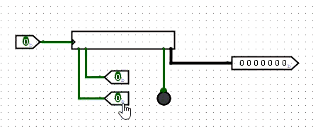
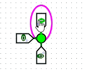
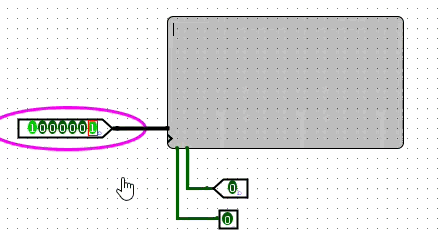
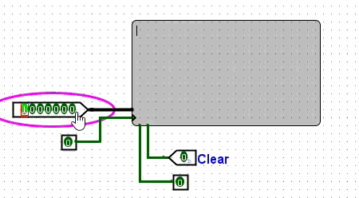
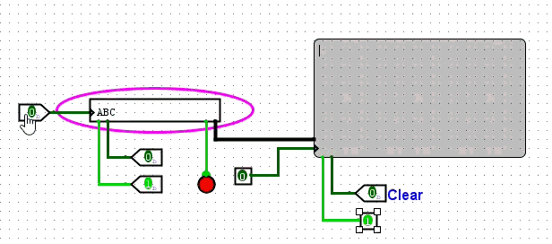
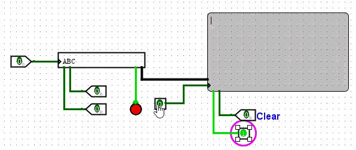

# Logsim
## Inputs / Outputs
### Button  
没有锁的按键  

### Dip Switch (Dual Inline Package Swtich, 双列拨码开关) 
1. 没有说明 
    > Logisim Evolution 是社区维护的开源项目。在最近的版本中（大约 3.x~4.x 之后）：DIP Switch 被重新实现，有时被归类到其他元件组；官方帮助文档里 暂时移除了说明文字；部分开发者觉得 DIP Switch 与多个 Input Pin 重复（功能上完全一样），所以他们简化文档，保留元件但删除了说明。  
    > 🧩 换句话说：它还存在，只是描述被删掉或隐藏，不代表功能没了。  
2. 就是很多个开关

### Joystick (摇杆, xy轴) 
位数可调

### Keyboard 键盘
1. 左侧：输入，左下一：输入使能  
2. 左下二：清空  
3. 右下二：寄存器指示，有 buffer 1  
4. 右下一：输出，ascii，7位  



### LED

### LED RGB
没有描述。

三输入，只有红绿蓝亮不亮，没有亮度调节  



### 7-Segement Display
七段显示器，就是数码管

### Hex Digit Display
十六进制数码管

### LED Matrix

### TTY （Teletypewriter，电传打字机）
这玩意见了好多次，一直不知道啥意思。就是打字机，后面衍生出终端的意思。

```docker
docker run --tty <container-key>
```

这个 TTY 的引脚要注意，WE 只代表是否使能写（i.e. 不需要时钟信号），时钟信号的上沿负责输入。





和键盘一起：




显然，原因是没有寄存器。另外用时钟肯定比手动好得多，我可不希望我的电脑是无数个小人在搬开关。。。


[Logisim_tut 电路图](../assets/circ/F/Logisim_tut.circ)

[IO 电路图](../assets/circ/F/IO.circ)