# Digital Circuits

## MOS, nMOS, pMOS, CMOS

简单来说，  

- MOS 相当于自动开关  
- 一相的 MOS 只能导通和断开  
- 数字电路不能悬空，如果想要低电平，必须要接地  
- 所以两相的 MOS 混合用，就能表示导通断开两个状态了。  

!!!note
    早期只用 nMOS，低电平表示 0，所以串一个电阻，默认nMOS截止，电流通过电阻变小，表示 0；如果想要高电平，就导通 MOS，电阻短路，表示高电平。  

## 门电路

### 或门

首先看之前的与非门。  

两个 cmos，nMOS 必须和VCC连接，pMOS 必须和地连接（否则会出现两连通或者两截止）。所以思考的时候，需要：永远 0 对应 VCC 导通

下面要考虑的就是，怎么安排串并联，让  
1. 两个行为相反  
2. 满足逻辑  

与非要求的就是：  

1. 11 时，VCC 截止，地连通   
    - 只有 11 时 VCC 截止，即其他时候导通    
    - nMOS 应该并联 - 一个导通，VCC就导通，只有两个都不导通，才VCC截止     
    - 只有11 地连通，其他时候截止    
    - pMOS 应该串联 - 都导通，才能导通    
2. 其他时候，VCC连通，地截止  

!!!note
    两个 cMOS 只能表示两种状态。  
    为什么这两种状态是 与非 & 或非？因为输入 0 对应 VCC 导通。  
    与 和 或 要更多的cMOS才行。（多一个非）。

所以类似地分析或非：

00时，VCC 连通，地截止  

- 只有 00 时，VCC 连通，nMOS 应该串联
- 所以 pMOS 应该并联

再加一个非门：

### 三输入与非门

最少情况下，全定制电路只需要3对CMOS。

对于半定制门电路，不难想象，对于 与非、或非 的连接，只要按照前缀和顺序安排 nMOS 串并联 和 pMOS 的相反串并联即可。所以任何 与非 和 或非 的表达式，需要的晶体管数量都应该等同于输入信号的两倍。

!!!note
    想到离散数学了吗？一个 Trivial 的思想显然是：  

    对于门电路：任意 n 输入布尔表达式都能化为仅含 NAND / NOR 与若干 NOT 的前缀析构形式。其 CMOS 实现所需的晶体管总数满足：

    $$
    T = 2 \times (\text{NAND/NOR 门的输入总数}) + 2 \times (\text{NOT 门数量})
    $$

    且

    $$
    \text{NOT 门数量} \le n
    $$

    (verified by ChatGPT 5 & Gemini 2.5 Pro)

两个逻辑门需要 4+2+4 = 10 个晶体管，因为需要 与非 (4) + 非 (2) + 与非 (4)。

对于区分上拉下拉网络的全定制电路，每多一个输入，会多一对晶体管，且由于只能对表达式进行有限的化简，可能多更多的非门。

后面可以看到，不区分上下拉网络时，可以用到更少的电路。如 同或 和 异或 都只需要 6 根，而非 8 根。

~~这种成本显然并不大 -- 多 20% 左右的~~ 显然不只有 20%。那为什么不用全定制呢？开发时间长？显然是，但是基于 AI 的自动推理简化程序就像自动布线一样重要了 -- 肯定还是手动更优，但是下降一定比例的冗余晶体管带来的成本优化似乎是显然的。这可能就是为什么 EDA 这么需要 AI 吧。

另一个更重要的方面是效率。多一倍的晶体管带来的成本绝不如性能开销显著，可以猜测我电脑 CPU、GPU、NPU 等肯定用了很大比例的全定制。。。

### 异或门

异或 和 或 很像，但是 11 的结果不同，而 11 可以用 与 表示， 所以 A XOR B 的逻辑可以描述为 `(A OR B) 且 (A AND B) 为假`，由此可以推导出：

$$
\begin{align*}
\text{A XOR B} &= (\text{A OR B}) \text{ AND } (\text{A NAND B}) \\
               &= (\text{NOT } (\text{A NOR B})) \text{ AND } (\text{A NAND B}) \\
               &= \text{NOT } ( (\text{A NOR B}) \text{ OR } (\text{NOT } (\text{A NAND B})) ) \\
               &= (\text{A NOR B}) \text{ NOR } (\text{NOT } (\text{A NAND B}))
\end{align*}
$$

于是只用了 $3 \times 4 + 2 = 14$ 个晶体管。

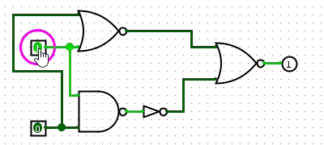

### 同或门

显然 同或门 是上面的取反。

$$
\begin{align*}
\text{A XNOR B} &= \text{NOT} ( (\text{A NOR B}) \text{ NOR } (\text{NOT } (\text{A NAND B})) ) \\
               &= \text{NOT} ( \text{NOT} ( (\text{A NOR B}) \text{ OR } (\text{NOT } (\text{A NAND B})) ) ) \\
               &= \text{NOT} ( (\text{NOT } (\text{A NOR B})) \text{ AND } (\text{A NAND B}) ) \\
               &= (\text{NOT } (\text{A NOR B})) \text{ NAND } (\text{A NAND B})
\end{align*}
$$

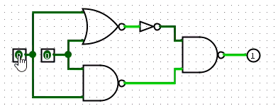

### 最少晶体管同或异或门

事实上，区分上下拉网络的话，用上面相同的思想，考虑信号的布尔式，而非 与非、或非门 的“布尔式”，再分解成串联、并联就行。

从真值表出发

|     | 同或 |
| --- | ---- |
| 00  | 1    |
| 01  | 0    |
| 10  | 0    |
| 11  | 1    |

也就是说

$$
A \text{ XNOR } B = ĀB̄ + AB
$$

!!!note
    $\cdot$ 串  
    $+$ 并

所以需要 2对 (NOT) + 2 x 2对 = 12 根。

!!!note
    真值表直接写出的表达式，很多时候不是最简的，进行化简的方法就是

    - 不用学的 “卡诺图化简”  
    - 现代的 QMC、espresso等  

但是显然，答案说可以 6 对，所以一定不能完全区分上下拉网络。

所以我显然想不到。

好处是 - 异或给了，反过来是同或。。。

先分析 XOR：

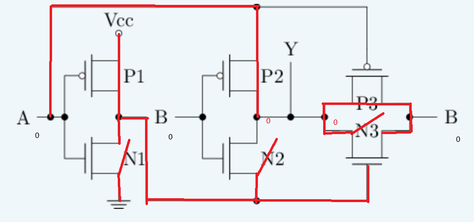

可以看到，说是 00 输出 0，实际并没有接地，是悬空状态。

这种实现当然不好。模拟一下：

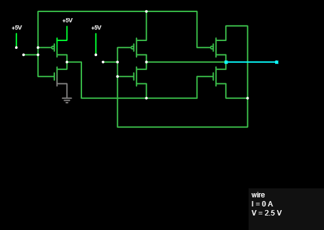

只有 2.5 v。

事实上，2.5v 也很好了，实际应用控制线 3.3v，电源线12v，发动不了或者直接炸了。。。

直接电源/地，pMOS/nMOS 互换

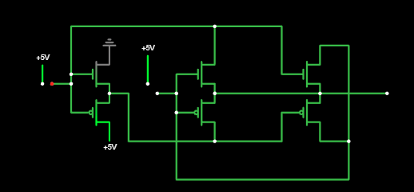

显然想不到，也不是好设计。模拟直接崩了。

## 进位计数法 Machine representation of integers

## 通过门电路搭建基本组合逻辑电路

### 译码器

译码器把 $k$ 位整数 变成 OHE。

!!!note
    什么神经？为啥这么干？明明 $k$ 条线就够了，为啥非要搞成 $2^k-1$ 条线？  
    事实上还挺有用，intuitive 的想法是，地址转换器。我想在地址 0x0001 取一个数，那肯定只有该地址的控制线应该被激活。

怎么实现呢？想想海明码？

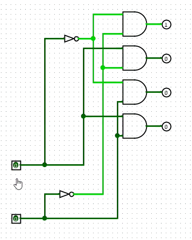

然而这个并不合适，用这个作为 38 DMX 会发下一个问题：

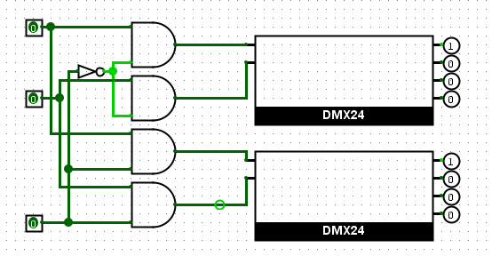

每个译码器都必定会有一个输出。这显然不好。（谁的内存只有一个颗粒呢？）  

然而很沮丧的是，我居然要为了每一个输出加一个 AND 门。好消息是，之后我不需要门电路来辅助构建新的DMX了。

!!!note
    记得计算机体系吗？片选确实需要线，不需要新的门

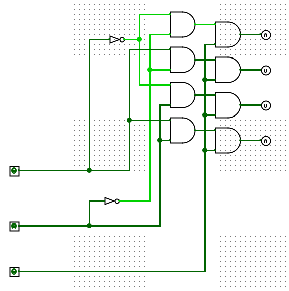

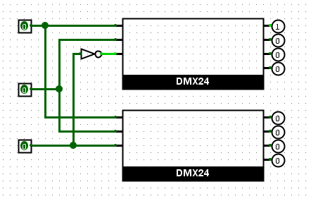

### Problem of Subcircuit Shape
!!!failure
    

### 数码管

#### 7段数码管
Naive 的办法：

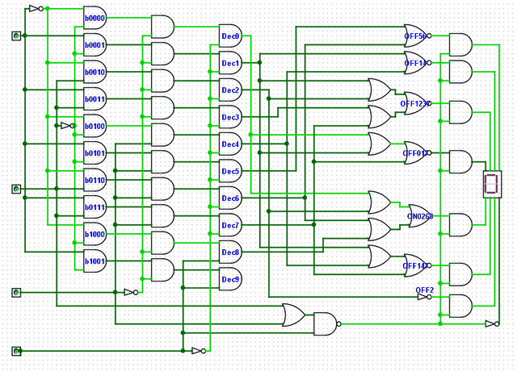

显然这不是非常好的办法，至少 9 的 OHE 根本没用。但是更多的优化——为啥不直接全定制呢？对啊，太麻烦了 Lol。

#### HEX 数码管
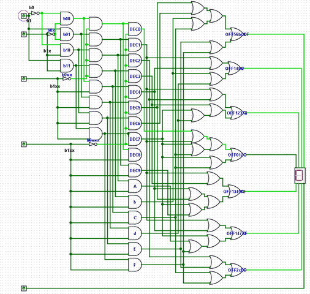

## 电路图
[DMX24](../assets/circ/F/_DMX24.circ)

[Digital Display](../assets/circ/F/DigitDisplay.circ)

### 编码器

就是一种节省的办法，只考虑 1 的贡献，独热性由系统保证。算是节省成本的方式。  

| 开关 | 数值 | 贡献      |
| ---- | ---- | --------- |
| 1    | 0000 | []        |
| 2    | 0001 | [0]       |
| 3    | 0010 | [1]       |
| 4    | 0011 | [0,1]     |
| 5    | 0100 | [2]       |
| 6    | 0101 | [0,2]     |
| 7    | 0110 | [1,2]     |
| 8    | 0111 | [0,1,2]   |
| 9    | 1000 | [3]       |
| 10   | 1001 | [0,3]     |
| 11   | 1010 | [1,3]     |
| 12   | 1011 | [0,1,3]   |
| 13   | 1100 | [2,3]     |
| 14   | 1101 | [0,2,3]   |
| 15   | 1110 | [1,2,3]   |
| 16   | 1111 | [0,1,2,3] |

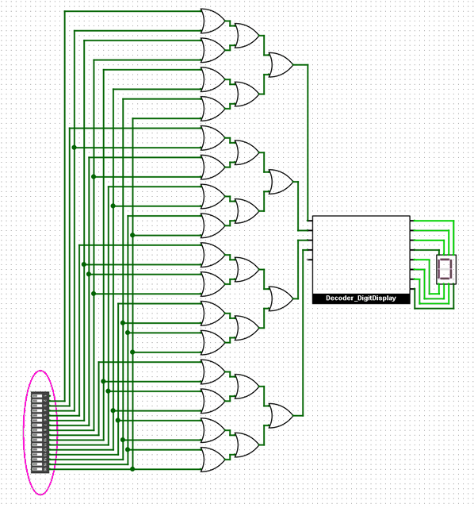

### 优先编码器

当系统不保证独热性的时候，或者有需要覆盖的时候，就用优先编码器。

现在，高位 0 和 1 都会贡献，每个数字都从最高位的 1 开始贡献。~~还是用或连接就行~~

并不是，比如 ob1101 和 0b1110，显然不能输出 ob1111。

最 naive 的方案，当然是每个输出加一个高位的禁止信号。

~~但是显然有更好的方案。~~ 并不显然。

GPT 推荐了一种优化方式：先掩码，再用编码器。显然这样效率更高，不需要那么多禁止信号了。

似乎没有更好的、逻辑清晰的方式了？ GPT 还推荐了一个更好的。前缀和的方式。但是也是先独热化。

前缀和的思想是，我记录之前的前缀和影响，去掉我当前信号的、与前缀信号不相符的影响。

从 ob1111 开始，之前无信号影响。看 ob1110，如果 ob1111 有信号，之前与现在不符的影响是 0bxxx1；如果之前信号不存在，前缀和是0。为了去除影响，0b1110 和 \~(ob1111) 取和，结果是没有更多贡献。本质上是对之前运算的复用

!!!note
    前缀和是非常常见的并行化思路了，通过复用之前的结果，减少了重复计算。

    Prefix sum 的坏处是增加了对前序计算的依赖。比如，ob 1111 0000 和 ob 0000 1111 两个前缀和是全 1 的。但是前缀和顺序算到这里需要很久。
    
    一种解决方式是分支预测：比如在第一个前缀和算完后，只需要考虑后 4 位有没有 1，于是可以忽略掉前面的位。进一步的思想是，对于复杂不可预测的分支，但是并没有计算的路径依赖，可以尝试乱序执行。
    
    另一种方式是：多路进位器，用更多的冗余计算来减少依赖延迟和存取延迟。
    
    这两种思想都对 CPU 执行条件分支语句的加速很有帮助，于是有了超标量流水线。

