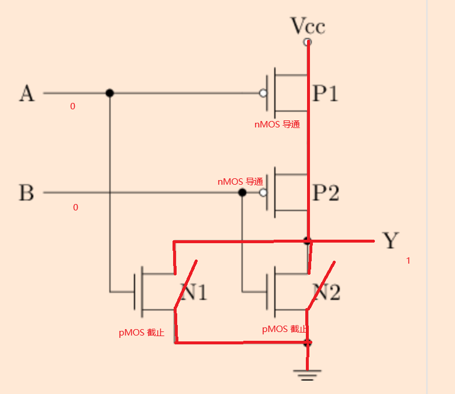
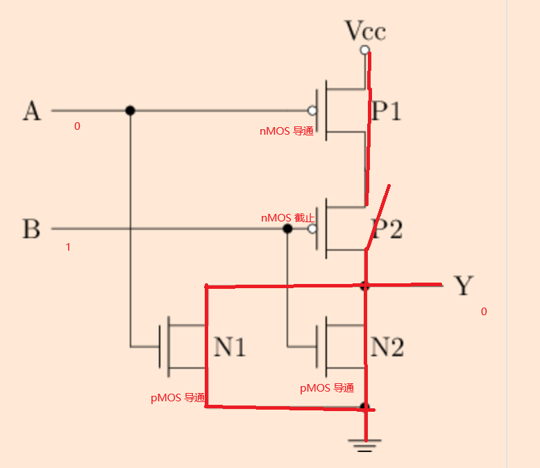
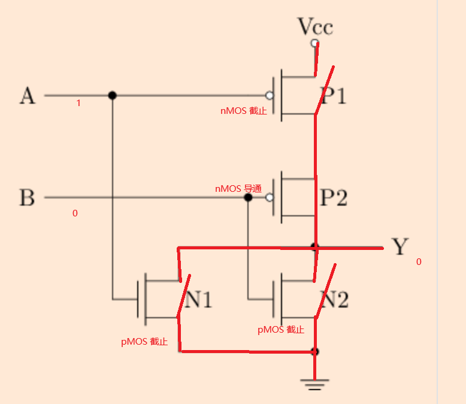
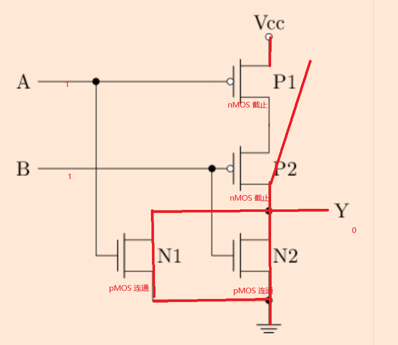
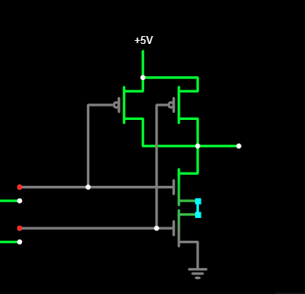
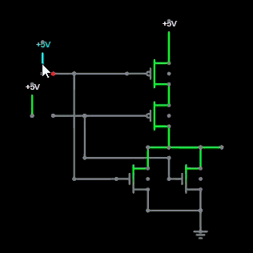
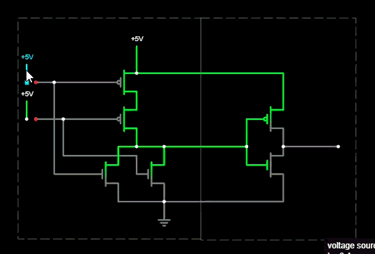

# Digital Circuits

## MOS, nMOS, pMOS, CMOS

简单来说，  

- MOS 相当于自动开关  
- 一相的 MOS 只能导通和断开  
- 数字电路不能悬空，如果想要低电平，必须要接地  
- 所以两相的 MOS 混合用，就能表示导通断开两个状态了。  

!!!note
    早期只用 nMOS，低电平表示 0，所以串一个电阻，默认nMOS截止，电流通过电阻变小，表示 0；如果想要高电平，就导通 MOS，电阻短路，表示高电平。  

## 门电路

## 或门

首先看之前的与非门。  

两个 cmos，nMOS 必须和VCC连接，pMOS 必须和地连接（否则会出现两连通或者两截止）。所以思考的时候，需要：永远 0 对应 VCC 导通

下面要考虑的就是，怎么安排串并联，让  
1. 两个行为相反  
2. 满足逻辑  

与非要求的就是：  

1. 11 时，VCC 截止，地连通   
    - 只有 11 时 VCC 截止，即其他时候导通    
    - nMOS 应该并联 - 一个导通，VCC就导通，只有两个都不导通，才VCC截止     
    - 只有11 地连通，其他时候截止    
    - pMOS 应该串联 - 都导通，才能导通    
2. 其他时候，VCC连通，地截止  

!!!note
    两个 cMOS 只能表示两种状态。  
    为什么这两种状态是 与非 & 或非？因为输入 0 对应 VCC 导通。  
    与 和 或 要更多的cMOS才行。（多一个非）。

所以类似地分析或非：

00时，VCC 连通，地截止  

- 只有 00 时，VCC 连通，nMOS 应该串联
- 所以 pMOS 应该并联

再加一个非门：

